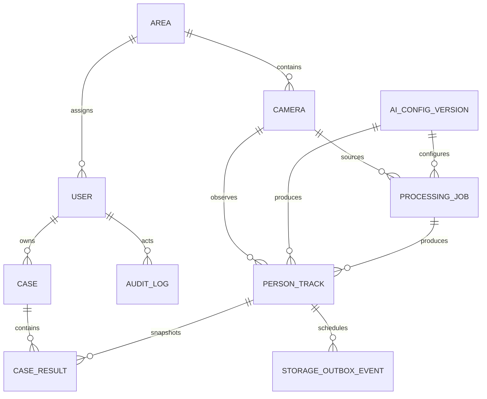

# PostgreSQL ER diagram and data dictionary

Schema tại revision `20260925_0004`:

## Data dictionary

| Bảng | Vai trò | Khóa/liên kết quan trọng | Quy tắc chính |
|---|---|---|---|
| `areas` | Danh mục khu vực | UUID, code duy nhất | Code uppercase và bất biến |
| `users` | Danh tính và vai trò | Area cho Operator | Operator bắt buộc có Area |
| `cameras` | Nguồn camera | FK Area | Area/code bất biến; không lưu credential RTSP |
| `ai_config_versions` | Phiên bản pipeline AI | Version duy nhất | Tối đa một bản `ACTIVE`; checksum checkpoint |
| `processing_jobs` | Một lượt xử lý nguồn | FK Camera/config | Sampling dương; timeline/progress hợp lệ |
| `person_tracks` | Metadata track xuyên ba kho | FK Camera/job/config | Bbox hợp lệ; state machine; không có Matching Score |
| `storage_outbox_events` | Retry thao tác kho ngoài | FK Track | Event theo track là duy nhất, attempts không âm |
| `cases` | Hồ sơ do Operator sở hữu | FK User `RESTRICT` | Không có status/area; owner lấy từ actor đăng nhập |
| `case_results` | Snapshot kết quả đã lưu | FK Case và Track | Cho phép lưu cùng track nhiều lần; snapshot bất biến |
| `audit_logs` | Nhật ký kiểm toán | Actor có thể null khi user bị xóa | Append-only; metadata JSONB đã lọc secret |

## Index theo truy vấn

- Tra cứu camera active trong Area: `ix_cameras_active_area`.
- Theo dõi job theo trạng thái: `ix_processing_jobs_status`.
- Timeline track theo camera: `ix_person_tracks_camera_appeared_at`.
- Search chỉ lấy track sẵn sàng: partial index
  `ix_person_tracks_ready_camera_appeared_at`.
- Danh sách Case của Operator: `ix_cases_owner_created_at`.
- Kết quả đã lưu và audit dùng các index theo owner/actor/target và timestamp.

Seed development được chạy chủ động bằng `person-search-seed`. Seed tạo Area và ba user có UUID ổn
định: `admin`/ADMIN, `operator`/OPERATOR thuộc `GATE-A`, `viewer`/VIEWER. Cả ba dùng password
`password`; chỉ dành cho local/demo và lệnh từ chối chạy khi `PERSON_SEARCH_ENV=production`.
