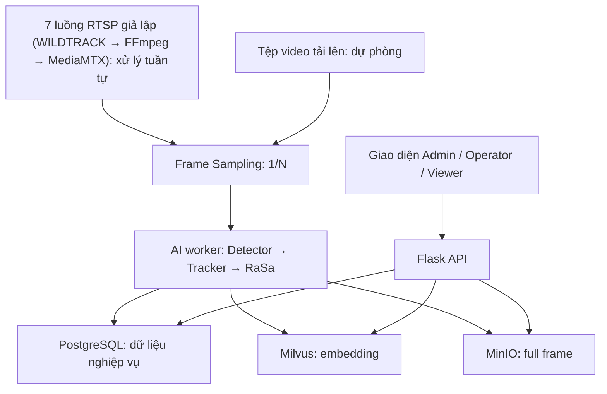
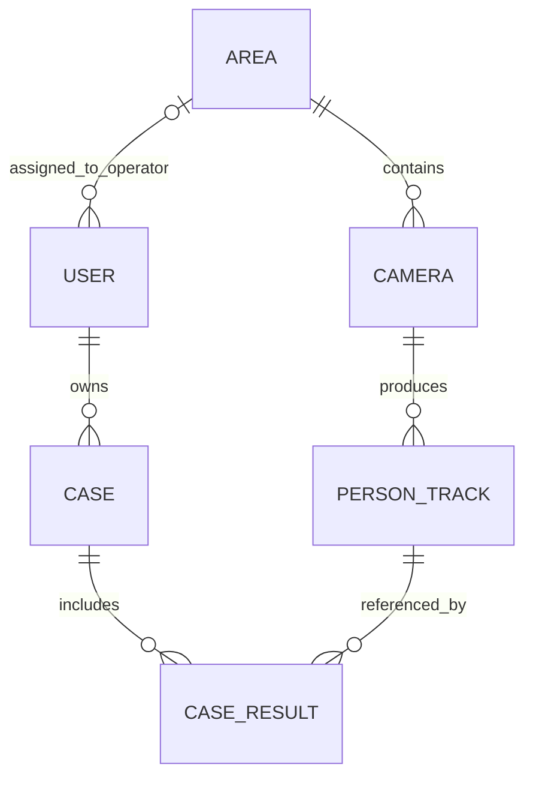

# PRISM — Kiến trúc ứng dụng tìm kiếm người qua camera — bản tổng hợp

> Tên hiển thị của ứng dụng: **PRISM — Person Retrieval via Image & Semantic Matching**.
>
> **Quy ước thuật ngữ trên giao diện:** Tài liệu dùng thuật ngữ thiết kế **Case**, **Admin**, **Operator**, **Viewer**; giao diện tiếng Việt hiển thị lần lượt là **vụ việc**, **Quản trị viên**, **Giám sát viên**, **Quản lý**. Chỉ các nội dung thuộc câu truy vấn (mô tả văn bản, giá trị thuộc tính, câu mô tả được sinh ra) dùng tiếng Anh.

> Tài liệu tổng hợp cuộc thảo luận về yêu cầu, use case, kiến trúc logic, dữ liệu, API, công nghệ và khả năng trình diễn đồ án tốt nghiệp. Những quyết định mới nhất trong tài liệu này thay thế các đề xuất trước đó nếu có mâu thuẫn. Nguồn dữ liệu chính là các luồng RTSP giả lập phát từ 7 video WILDTRACK; các camera được xử lý AI tuần tự.
>
> **Thẩm quyền tài liệu:** `architect.md` (kiến trúc chung), `project_requirements.md` và `usecase_detail.md` là ba tài liệu đặc tả nguồn. `backend_implementation_plan.md`, `storage_database_implementation_plan.md` và `ai_worker_implementation_plan.md` là kế hoạch thực thi chi tiết được xây dựng dựa trên ba tài liệu nguồn; khi có mâu thuẫn, kế hoạch phải được sửa cho khớp với tài liệu nguồn, không phải ngược lại.

## 1. Mục tiêu và phạm vi

Ứng dụng nhận luồng video gắn với camera logic, lấy mẫu frame, phát hiện và theo dõi người, tạo một embedding cho mỗi lần xuất hiện (track) bằng bộ mã hóa ảnh của **RaSa**, rồi cho Operator tìm kiếm bằng ảnh, mô tả văn bản tiếng Anh hoặc các thuộc tính ngoại hình tiếng Anh. Operator tự đánh giá các kết quả và lưu track đã chọn vào Case. Viewer xem các Case; Admin quản trị tài khoản, camera và cấu hình AI. **Nguồn chính là luồng RTSP giả lập**: mỗi video WILDTRACK (`cam1.mp4` … `cam7.mp4`) được FFmpeg phát vào MediaMTX thành một luồng RTSP gắn với một camera logic. **Tệp video tải lên** được giữ làm đường dự phòng; hai nguồn đi vào cùng pipeline xử lý sau bước đọc frame.

Phạm vi là **đồ án tốt nghiệp**, tập trung xây dựng ứng dụng hoạt động và có thể trình diễn; AI chỉ được **sử dụng** (mô hình có sẵn), không nghiên cứu mô hình mới và không nhằm triển khai thương mại. Dữ liệu hiện có gồm **7 video camera của bộ WILDTRACK** và 7 camera logic tương ứng. Worker xử lý AI **tuần tự, một camera tại một thời điểm** (concurrency = 1); mỗi phiên RTSP được giới hạn số frame rồi chuyển sang camera tiếp theo. Không có yêu cầu xử lý đồng thời cả 7 luồng AI.

### Trạng thái các quyết định quan trọng

| Nội dung | Trạng thái hiện tại |
| --- | --- |
| Camera và khu vực | Một camera thuộc đúng một khu vực, gán lúc tạo và **không thể đổi** về sau; một khu vực có nhiều camera. |
| Camera ngừng vận hành | Dừng nhận luồng camera vào để xử lý và lưu trữ; dữ liệu đã tạo được giữ nguyên (không xóa) nhưng **tạm thời không được tìm kiếm**, không được chọn làm bộ lọc và không thêm mới vào Case cho đến khi camera được đưa vào vận hành trở lại; kết quả đã lưu trong Case trước đó vẫn xem được bình thường. |
| Operator và khu vực | Mỗi Operator được Admin gán đúng một khu vực hiện tại; tìm kiếm mới chỉ trên camera thuộc khu vực này. |
| Quản lý khu vực | Không có use case CRUD khu vực. **Đã chốt:** danh mục khu vực được khai báo trước bằng seed (mã ổn định, bất biến + tên hiển thị); Admin chọn từ danh mục này khi tạo camera/gán Operator. |
| Case cũ khi đổi khu vực | Operator tiếp tục xem và quản lý Case do mình sở hữu, kể cả sau khi được chuyển sang khu vực khác. |
| Số kết quả tìm kiếm | `top_k` chỉ được chọn trong **4, 8, 12, 16**; backend kiểm tra tập giá trị này. |
| Matching Score | **Chỉ tính/hiển thị trong lần tìm kiếm** để xếp hạng và giúp Operator đánh giá. Không lưu vào PersonTrack/CaseResult, không hiển thị lại trong Case. |
| Lưu cùng track nhiều lần | Mỗi lần Operator bấm lưu tạo một `CaseResult` riêng. Không kiểm tra trùng track trong cùng Case. |
| Ảnh kết quả | Lưu một full frame đại diện và bounding box theo track; crop người được dựng động, không lưu person crop độc lập. |
| Trạng thái Case | Case có trạng thái **Đang xử lý (`OPEN`)** hoặc **Hoàn thành (`CLOSED`)**. Case hoàn thành bị khóa (không thêm/loại kết quả, không sửa tiêu đề/ghi chú), không hiện khi thêm vào Case đã có; Operator phụ trách có thể mở lại. |
| Cấu hình mô hình | Admin chọn Detector và Tracker từ danh sách đăng ký sẵn; cấu hình **chung cho toàn hệ thống**, không riêng theo camera. Hai encoder cố định trong phiên bản đầu. |
| Frame Sampling | Sau khi đọc nguồn video và **trước Detector**, chỉ chuyển 1 frame trong mỗi `N` frame nguồn tới Detector/Tracker. Benchmark local CPU ngày 2026-09-27 chốt mặc định demo `throughput` (`N=20`); `baseline` (`N=10`) vẫn là preset chất lượng dày hơn. Admin không nhập giá trị tùy ý và mỗi job lưu `N` thực tế. |
| Bộ mã hóa ảnh/văn bản | **RaSa — Relation and Sensitivity Aware Representation Learning for Text-based Person Search** theo đề xuất của giảng viên và lựa chọn của người làm đồ án; dùng checkpoint CUHK-PEDES chính thức (vector 256 chiều, L2-normalized, metric IP) cho cả ảnh và văn bản; cần đánh giá chất lượng tìm bằng ảnh và mô tả tiếng Anh trên 7 video. |
| Ngôn ngữ truy vấn | **Chỉ tiếng Anh** cho mô tả văn bản và bộ lọc thuộc tính; không hỗ trợ tiếng Việt và không dịch tự động. |
| Công nghệ | Người làm đồ án muốn dùng **Flask API**, **Milvus** và **MinIO** vì đã học. PostgreSQL (dữ liệu nghiệp vụ) và React + Vite (giao diện) đã được chốt và triển khai; các thành phần khác ở mục 9. |
| Colab | Có thể dùng để thử mô hình/xử lý theo đợt; chưa chọn làm AI worker chạy liên tục của ứng dụng. |
| Đầu vào và cách demo | 7 video WILDTRACK được phát thành 7 luồng RTSP giả lập (FFmpeg + MediaMTX), mỗi luồng gắn một camera logic; worker xử lý tuần tự từng camera. Khi demo có thể chuẩn bị sẵn dữ liệu đã index, rồi trình diễn xử lý thêm một phiên RTSP. Tải tệp video lên là đường dự phòng dùng cùng pipeline. |

## 2. Vai trò và chức năng

### Admin

- Đăng nhập, đăng xuất; tạo/cập nhật/khóa hoặc ngừng hoạt động tài khoản; gán đúng một khu vực cho Operator.
- Tạo và cập nhật camera logic, gán khu vực và địa chỉ RTSP (luồng giả lập) lúc tạo, bật/tắt xử lý AI, loại camera khỏi vận hành và đưa camera vận hành trở lại (AI ở trạng thái tắt). Khi cập nhật camera, không thể đổi khu vực. Có thể kiểm tra kết nối luồng RTSP; camera có RTSP đang mất kết nối không được bật AI.
- Chọn Detector/Tracker đã đăng ký sẵn cho **toàn bộ hệ thống**; kiểm tra khả năng tương thích và khả năng áp dụng.
- Xem trạng thái camera/RTSP/AI, chạy chẩn đoán AI, xem audit log.
- Quyền quản trị kỹ thuật không mặc nhiên cấp quyền tìm kiếm người hoặc xem mọi Case.

### Operator

- Được phép tìm kiếm track từ camera thuộc **khu vực hiện tại** của mình; có thể lọc tiếp camera và khoảng thời gian.
- Tìm bằng ảnh crop tải lên, mô tả văn bản tiếng Anh, hoặc thuộc tính tiếng Anh được giao diện chuyển thành câu mô tả tiếng Anh có cấu trúc cho RaSa Text Encoder. Hệ thống không nhận truy vấn tiếng Việt và không dịch tự động.
- Chọn `top_k` trong 4, 8, 12, 16; xem ảnh người, camera, khu vực, thời gian và Matching Score; bấm ảnh để mở full frame kèm bounding box. Operator tự quyết định kết quả có phù hợp hay không.
- Tạo Case hoặc thêm kết quả vào Case của mình; sửa tiêu đề, ghi chú và xóa từng mục đã lưu. Không thể chuyển owner Case sang người khác.
- Luôn xem được Case mình sở hữu và ảnh trong Case đó sau khi được gán sang khu vực mới. Các lần tìm kiếm sau khi chuyển chỉ theo khu vực mới.

### Viewer

- Xem dashboard toàn hệ thống: tổng số Case, số Case đang xử lý/đã hoàn thành, **số mục CaseResult** (tính cả các mục lặp cùng track), danh sách Case gần đây kèm trạng thái.
- Lọc/xem mọi Case và kết quả đã lưu, xem ảnh crop/full frame kèm bounding box, chỉ đọc.
- Không tìm kiếm AI, quản lý camera/tài khoản/mô hình hoặc chỉnh sửa Case. Case không có Matching Score để Viewer xem lại.

Các use case đã được đối chiếu: UC-01 đăng nhập, UC-02 quản lý tài khoản, UC-03 quản lý camera, UC-04 bật/tắt AI, UC-05 cấu hình mô hình, UC-06 trạng thái, UC-07 kiểm tra AI, UC-08 audit log, UC-09 tìm kiếm, UC-10 đánh giá kết quả, UC-11 quản lý Case, UC-12 dashboard Viewer, UC-13 xem Case, UC-14 xem mục kết quả đã lưu và UC-15 đăng xuất.

## 3. Ranh giới thành phần

- **Flask API** xác thực, phân quyền, điều phối tìm kiếm, quản lý Case, quản lý cấu hình và cung cấp ảnh sau khi kiểm tra quyền. API không giữ vòng lặp RTSP chạy mãi trong một request.
- **AI worker Python** chạy riêng, đọc frame từ luồng RTSP giả lập (hoặc tệp video dự phòng), lấy mẫu theo `N`, rồi xử lý bằng cùng Detector/Tracker/buffer và RaSa Image Encoder. Mỗi tác vụ xử lý gắn với một `camera_id`; worker chạy lần lượt các tác vụ, một camera tại một thời điểm. Việc đặt encoder truy vấn ảnh/văn bản trong cùng tiến trình AI hoặc một tiến trình suy luận riêng là chi tiết triển khai cần đo theo RAM; Flask có thể gọi nội bộ để lấy query embedding.
- **PostgreSQL** là phương án đề xuất cho dữ liệu nghiệp vụ quan hệ: tài khoản, khu vực, camera, track, Case, CaseResult, cấu hình AI, audit log, trạng thái lập chỉ mục. Đây là lựa chọn đã chốt và là nguồn sự thật về quyền/trạng thái.
- **Milvus** lưu embedding ảnh RaSa của track kèm `track_id` và các trường phục vụ lọc khu vực/camera/thời gian. Hệ thống nghiệp vụ vẫn là nơi xác định quyền; Milvus không thay thế database Case/User. Với tìm kiếm bằng văn bản, Milvus tạo danh sách ứng viên; có thể dùng bộ so khớp ảnh–văn bản của RaSa để xếp hạng lại nếu tài nguyên cho phép.
- **MinIO** lưu một full frame đại diện của mỗi track; PostgreSQL giữ bucket/object key. Bucket không được công khai để bỏ qua kiểm tra quyền của Flask.
- **FFmpeg + MediaMTX** phát 7 video WILDTRACK thành 7 luồng RTSP giả lập, đóng vai trò hệ thống camera của ứng dụng. Không cần đưa toàn bộ video vào MinIO chỉ để tạo ảnh kết quả.

### Dữ liệu đi qua ba nơi lưu trữ

Một `track_id` liên kết bản ghi `PersonTrack` trong PostgreSQL, embedding trong Milvus và full frame trong MinIO. Nếu lưu một kết quả vào Case, `CaseResult` trong PostgreSQL tham chiếu `track_id`; không nhân bản embedding hoặc crop. Tính nhất quán xuyên ba nơi lưu cần được bảo đảm bằng trạng thái `PENDING/READY` (đề xuất): chỉ hiển thị track trong tìm kiếm khi ảnh, metadata và embedding cần thiết đã ghi thành công. Nếu một bước thất bại, worker báo lỗi và cho phép thử lại; không coi dữ liệu dở dang là kết quả tìm kiếm hoàn chỉnh.

## 4. Khu vực, camera và quyền

1. `Area` có mã ổn định và tên hiển thị. **Đề xuất cho đồ án:** tạo sẵn danh mục ban đầu, không làm màn hình quản lý khu vực riêng; Admin chọn danh mục đã khai báo khi tạo camera/gán Operator.
2. `Camera.area_id` bắt buộc lúc tạo và bất biến. Admin có thể sửa tên, địa chỉ RTSP, thông tin xác thực, trạng thái vận hành và AI theo quyền, nhưng cả giao diện lẫn backend phải chặn thay đổi khu vực. Ngừng vận hành camera nghĩa là **không tiếp tục nhận luồng camera vào để xử lý và lưu trữ**; track/frame/embedding đã tạo trước đó không bị hard-delete nhưng tạm thời không được tìm kiếm, không được chọn làm bộ lọc và không thêm mới vào Case cho đến khi Admin đưa camera vào vận hành trở lại. Kết quả đã lưu trong Case vẫn xem được.
3. Operator có đúng một `assigned_area_id` hiện tại. Backend lấy khu vực từ phiên đăng nhập, không tin một `area_id` do client gửi để mở rộng quyền.
4. Với tìm kiếm mới, backend xác định các camera **đang vận hành** thuộc khu vực hợp lệ và lọc camera/thời gian trước khi chọn `top_k`. Request chứa camera ngoài quyền hoặc camera đang ngừng vận hành bị từ chối. Xem ảnh kết quả tìm kiếm cũng cần kiểm tra quyền.
5. Case thuộc owner của nó, **không gắn với khu vực**. Khi Operator chuyển khu vực, quyền xem Case cũ dựa trên owner lịch sử, còn quyền tìm kiếm mới dựa trên khu vực hiện tại. Viewer xem mọi Case theo quyền chỉ đọc.

## 5. Mô hình dữ liệu logic

Tên trường dưới đây là **đề xuất schema** dựa trên quy tắc đã chốt; kiểu dữ liệu, độ dài chuỗi, chỉ mục và migration sẽ xác định ở bước triển khai.

| Thực thể lõi | Trường đề xuất | Ràng buộc/ý nghĩa |
| --- | --- | --- |
| `Area` | `area_id`, `code`, `name` | `code` duy nhất và ổn định; Admin/Viewer không cần được gán Area. |
| `User` | `user_id`, `username`, `password_hash`, `display_name`, `role`, `status`, `assigned_area_id`, `created_at` | Operator cần đúng một Area hiện tại; owner User lịch sử phải được giữ để Case và audit log còn truy vết. |
| `Camera` | `camera_id`, `area_id`, `name`, thông tin RTSP và xác thực, `operational_status`, `rtsp_status`, `ai_enabled`, `created_at` | `area_id` bắt buộc và bất biến; RTSP là nguồn chính (luồng giả lập). Bảo vệ thông tin xác thực RTSP. |
| `PersonTrack` | `track_id`, `camera_id`, `started_at`, `ended_at`, `representative_frame_object_key`, `bbox`, tham chiếu embedding, `ai_config_version`, `encoder_version`, `sampling_interval`, `index_status` | Mỗi track là một lần xuất hiện, không phải từng frame. Mốc thời gian theo video gốc; full frame + bbox đủ dựng ảnh người và ảnh toàn cảnh. |
| `Case` | `case_id`, `title`, `note`, `owner_user_id`, `status`, `closed_at`, `created_at`, `updated_at` | Owner lấy từ phiên Operator lúc tạo, không nhận owner tùy ý; `status` là `OPEN` hoặc `CLOSED`, `closed_at` chỉ có giá trị khi `CLOSED`; Case không có `area_id`. |
| `CaseResult` | `case_result_id`, `case_id`, `track_id`, `saved_at`, `camera_name_at_save`, `area_name_at_save`, `appeared_at_save` | Mỗi lần bấm lưu tạo mục mới; **không unique trên `(case_id, track_id)`** và **không có `matching_score`**. Metadata đã lưu vẫn hiển thị nếu tên camera thay đổi hoặc ảnh gặp lỗi. |

Các dữ liệu hỗ trợ nằm ngoài sáu thực thể lõi: danh sách Detector/Tracker đăng ký sẵn, cấu hình AI đang hoạt động, audit log, trạng thái phiên đăng nhập và thông tin vận hành. Đề xuất một bản ghi **`ActiveAIConfig` dùng chung toàn hệ thống** chứa `detector_id`, `tracker_id`, `config_version`, thời điểm áp dụng/trạng thái; mỗi `PersonTrack` lưu phiên bản đã dùng. Không có cặp Detector/Tracker trên từng `Camera`. Tham số `sampling_interval=N` gắn với tác vụ xử lý video để có thể so sánh thử nghiệm; encoder RaSa cố định ở phiên bản đầu, lưu phiên bản checkpoint trên track/vector để không trộn các không gian embedding khác nhau.

### Vòng đời dữ liệu

- **Track Buffer** chỉ giữ frame/bounding box ứng viên khi track đang hoạt động; có giới hạn và được giải phóng sau khi track kết thúc/xử lý xong. Buffer không phải kho dữ liệu tìm kiếm.
- Track hoàn chỉnh giữ embedding, full frame đại diện, bounding box và metadata để tìm kiếm. Bản đầu chỉ lưu **một frame đại diện**; frame này được chọn bằng bộ chọn chất lượng deterministic (độ phân giải, độ nét, độ đầy đủ cơ thể, độ ổn định, cắt biên/che khuất) từ tối đa 3 ứng viên giữ trong bộ nhớ. Không lưu nhiều frame và không gộp nhiều embedding cho một track.
- Dữ liệu track/frame/embedding mà Case tham chiếu không bị tự động xóa. Với dữ liệu chưa được Case tham chiếu, bản demo chưa chốt chính sách tự xóa; có thể giữ trong phạm vi đồ án và xem xét sau.
- Xóa một `CaseResult` chỉ xóa liên kết/mục đó; không xóa track, frame, embedding hoặc mục khác cùng track. Nếu tài khoản/camera ngừng hoạt động, Case lịch sử vẫn được giữ.

## 6. Các luồng xử lý

### 6.1. Từ luồng RTSP giả lập (hoặc tệp video) đến track có thể tìm kiếm

1. **Nguồn chính:** FFmpeg phát từng video WILDTRACK vào MediaMTX thành luồng RTSP; mỗi camera logic trỏ tới một luồng. Worker tạo phiên xử lý cho từng camera đang bật AI, đọc giới hạn số frame từ luồng rồi chuyển camera tiếp theo (tuần tự, concurrency = 1). **Đã triển khai:** khi hàng đợi trống, worker tự tạo một phiên RTSP cho camera đang vận hành, bật AI, có RTSP và lâu nhất chưa được xử lý (mặc định 1.800 frame nguồn/phiên, lấy mẫu `N=20`); camera có phiên lỗi được bỏ qua 5 phút; tắt bằng `PERSON_SEARCH_RTSP_AUTO=0`. `scripts/rtsp.ps1` dựng MediaMTX và phát lặp `cam1.mp4` … `cam7.mp4`. **Dự phòng:** Admin tải tệp video lên gắn với camera logic; worker đọc frame từ tệp. Hai cách đọc frame đi qua cùng các bước tiếp theo.
2. **Frame Sampling:** đếm frame của nguồn và chỉ chuyển một frame cho mỗi `N` frame (`N=10` và `N=20` là hai giá trị thử). Các frame bỏ qua không chạy Detector/Tracker; vẫn giữ `source_frame_index` và timestamp nguồn để suy ra thời gian xuất hiện đúng. Ví dụ video 30 fps lấy `1/20` chỉ còn khoảng 1,5 frame được xử lý mỗi giây: người đi nhanh có thể biến mất giữa hai lần lấy mẫu.
3. Detector phát hiện người trên frame được chọn; Tracker nối các phát hiện qua **các frame đã lấy mẫu** thành track theo từng camera. Buffer tạm giữ ứng viên trong lúc track hoạt động. Cần thử `N` vì lấy mẫu quá thưa có thể làm đứt track hoặc tăng số track giả; điều chỉnh điều kiện kết thúc track theo thời gian thực hoặc số frame đã lấy mẫu, không coi 20 frame nguồn bị bỏ qua là 20 frame Tracker đã nhận.
4. Khi track kết thúc hoặc hết thời gian chờ, worker chọn một frame đại diện cùng bounding box, crop người tạm thời rồi đưa vào **RaSa Image Encoder** để tạo một embedding ảnh cho track.
5. Worker lưu full frame vào MinIO, metadata track/phiên bản Detector-Tracker/RaSa/`N` vào PostgreSQL và vector/`track_id` cùng trường lọc vào Milvus; chỉ sau khi dữ liệu nhất quán mới đánh dấu track tìm kiếm được.
6. Worker giải phóng buffer; không lưu crop độc lập. Tắt AI hoặc camera ngừng vận hành dừng tạo track mới. Tắt AI không ảnh hưởng tìm kiếm track đã có; camera ngừng vận hành thì track của nó được giữ nhưng tạm ẩn khỏi tìm kiếm cho đến khi camera vận hành trở lại.

### 6.2. Tìm kiếm và đánh giá

1. Operator cung cấp ảnh (chọn tệp, kéo thả, dán, hoặc kéo một kết quả vào để tìm tiếp), văn bản hoặc thuộc tính. Ảnh dùng cùng RaSa Image Encoder đã lập chỉ mục; văn bản chỉ nhận mô tả tiếng Anh; thuộc tính chọn sẵn (tên/giá trị tiếng Anh) được chuyển thành câu tiếng Anh có kiểm soát cho RaSa Text Encoder. RaSa được huấn luyện và công bố trên bộ dữ liệu caption tiếng Anh, vì vậy hệ thống không nhận truy vấn tiếng Việt và không có bước dịch tự động.
2. Operator chọn `top_k` thuộc `{4, 8, 12, 16}`, camera/thời gian tùy chọn. Flask lấy khu vực từ tài khoản, xác định camera hợp lệ và gửi điều kiện lọc khu vực/camera/thời gian cho Milvus **trước khi lấy top kết quả**.
3. Milvus xếp hạng vector ảnh RaSa; Flask ghép `track_id` với metadata PostgreSQL và ảnh MinIO, đồng thời kiểm tra track đã sẵn sàng và thuộc quyền. Với văn bản, có thể thử bước xếp hạng lại một số ứng viên bằng bộ image–text matching của RaSa sau truy vấn Milvus. Nếu có ít track hơn `top_k`, trả số lượng thực có. So sánh ảnh–ảnh bằng vector ảnh RaSa là cách áp dụng cần đo thực nghiệm, không mặc định có chất lượng như kết quả tìm kiếm văn bản–ảnh công bố của RaSa.
4. Kết quả hiển thị crop người dựng từ full frame + bbox, camera, khu vực, thời gian và **Matching Score của lần tìm kiếm hiện tại**. API crop nhận `?aspect=` (nới vùng cắt theo tỉ lệ khung bằng cảnh xung quanh, không cắt vào người) và `?mark=1` (viền người được tìm thấy, làm tối phần còn lại); danh sách ưu tiên thứ hạng, camera, giờ, điểm ở dạng phụ, khu vực/ngày chung hiển thị một lần ở đầu danh sách. Operator có thể lọc/sắp xếp danh sách đang xem và mở full frame + bbox để tự đánh giá. Không dùng ngưỡng Matching Score để loại kết quả; confidence nội bộ Detector không hiển thị.

### 6.3. Lưu Case, xem Case

1. Operator chọn một track và tạo Case hoặc thêm vào Case do mình sở hữu. Giao diện chỉ cần gửi `track_id`, thông tin Case/định danh Case; **không cần `result_ref` hay điểm**. Tùy chọn "đánh dấu hoàn thành khi lưu" được giao diện thực hiện bằng hai bước: lưu kết quả, rồi `PATCH /cases/{id}` với `status: CLOSED` theo `version` mới nhất; nếu bước sau lỗi thì kết quả đã lưu vẫn giữ nguyên.
2. Flask kiểm tra Operator, quyền đối với track ở khu vực hiện tại, quyền sở hữu Case; khi tạo Case lấy owner từ phiên đăng nhập. Flask lấy metadata cần snapshot từ dữ liệu server.
3. **Mỗi lần bấm lưu tạo `CaseResult` mới**, kể cả nếu Case đã chứa cùng `track_id`. Lưu metadata camera/khu vực/thời gian, không lưu Matching Score. Dashboard đếm số mục CaseResult.
4. Operator đánh dấu Case **Hoàn thành** khi xử lý xong: Case bị khóa (từ chối thêm/loại kết quả và sửa tiêu đề/ghi chú với lỗi `409 case_closed`) và bị loại khỏi danh sách "Thêm vào Case đã có"; Operator có thể **mở lại** để quay về Đang xử lý. Đóng/mở lại được ghi audit (`case.closed`, `case.reopened`).
5. Operator/Viewer mở Case thì xem ảnh crop động, camera, khu vực, thời gian; bấm ảnh xem full frame có bbox. Không có điểm phù hợp ở màn hình Case. Operator chuyển khu vực vẫn xem ảnh trong Case mình sở hữu qua quyền Case cũ; Viewer xem toàn bộ Case chỉ đọc.
6. Nếu frame/bbox không khả dụng, Case vẫn hiện metadata đã snapshot và thông báo không thể dựng ảnh. Xóa một mục theo `case_result_id` không xóa mục khác hay dữ liệu track gốc.

### 6.4. Đổi Detector/Tracker chung

1. Admin chọn Detector và/hoặc Tracker trong danh sách đăng ký sẵn. Backend kiểm tra khả năng tương thích và ghi nhận yêu cầu cấu hình **chung**.
2. Các track đang hoạt động kết thúc hoặc đến hạn chờ theo cấu hình cũ. Worker nạp cặp mới, áp dụng cho track mới trên mọi camera đang bật AI. Nếu nạp/áp dụng thất bại, giữ cặp đang hoạt động và thông báo lỗi.
3. Ghi `ai_config_version` trên track, trạng thái cấu hình đang yêu cầu/đang hoạt động và sự kiện thay đổi vào audit log. Cặp RaSa Image/Text Encoder cố định, không phải lựa chọn của Admin trong bản đầu. Ghi cả `sampling_interval` và phiên bản checkpoint RaSa dùng cho dữ liệu mới.

## 7. Ma trận quyền tóm tắt

| Hành động | Admin | Operator | Viewer |
| --- | --- | --- | --- |
| Tài khoản, khu vực Operator, camera, RTSP, AI, Detector/Tracker | Quản trị | Không | Không |
| Trạng thái, chẩn đoán AI, audit log | Có | Không | Không |
| Tìm kiếm người, ảnh kết quả tìm kiếm | Không mặc định | Chỉ camera/kết quả trong khu vực hiện tại | Không |
| Tạo/sửa Case, thêm/xóa CaseResult | Không | Chỉ Case do mình sở hữu; kết quả mới phải thuộc quyền | Không |
| Xem Case và ảnh trong Case | Không mặc định | Case của mình, kể cả sau khi đổi khu vực | Mọi Case, chỉ đọc |
| Dashboard tổng quan Case | Không | Không | Toàn hệ thống |

Mọi quyền được kiểm tra tại Flask cho từng request, bao gồm request lấy crop/full frame. Địa chỉ RTSP chỉ được kết nối khi là IP thuộc dải mạng camera được khai báo (`PERSON_SEARCH_RTSP_NETWORKS`); địa chỉ loopback/link-local bị từ chối, và thông tin xác thực RTSP được mã hóa khi lưu. Không để trình duyệt truy cập bucket MinIO công khai hoặc tin owner/area do client tự khai báo. Phiên đăng nhập hết hạn/tài khoản bị khóa không được dùng gọi API mới; Case lịch sử vẫn tồn tại cho Viewer.

## 8. Phác thảo API

Đây là nhóm endpoint đề xuất để triển khai từng bước; tên và payload cuối cùng sẽ chốt trong tài liệu API riêng.

| Nhóm | API ví dụ | Quy tắc cốt lõi |
| --- | --- | --- |
| Xác thực | `POST /auth/login`, `POST /auth/logout` | Phiên hợp lệ, vai trò và trạng thái tài khoản. |
| Admin / khu vực | `GET /areas`, API tài khoản | Danh mục khu vực khai báo sẵn để chọn khi gán Operator. |
| Admin / camera | API tạo/sửa camera, kiểm tra kết nối RTSP, bật/tắt AI (từ chối `409 camera_offline` khi camera RTSP mất kết nối), loại khỏi vận hành, đưa vận hành trở lại (`POST /admin/cameras/{id}/reactivate`), tải tệp video dự phòng gắn camera, trạng thái | Khi sửa, backend từ chối đổi `area_id`; RTSP giả lập là nguồn chính, tệp video là dự phòng; ngừng camera dừng nhận luồng mới, không xóa lịch sử; dữ liệu cũ tạm ẩn khỏi tìm kiếm cho tới khi camera vận hành trở lại. |
| Admin / mô hình | API danh sách Detector/Tracker và cập nhật cấu hình đang dùng | Một cấu hình chung, chỉ chọn cặp hợp lệ; áp dụng lỗi giữ cặp trước. |
| Tìm kiếm | `POST /searches/image`, `/searches/text`, `/searches/attributes` | Phương thức truy vấn, camera đang vận hành trong khu vực/thời gian tùy chọn, `top_k` thuộc `{4,8,12,16}`; khu vực từ phiên Operator. Response có `track_id`, metadata, điểm tạm thời. |
| Case | `POST /cases`, `GET /cases?status=`, `GET /cases/{id}`, `PATCH /cases/{id}` | Owner khi tạo lấy từ phiên; Operator chỉ xem/sửa Case mình, Viewer chỉ đọc tất cả. `PATCH` nhận `status` (`OPEN`/`CLOSED`) để đánh dấu hoàn thành hoặc mở lại. |
| Mục trong Case | `POST /cases/{id}/results`, `DELETE /cases/{id}/results/{case_result_id}` | POST nhận `track_id`, không nhận Matching Score; mỗi lần gọi hợp lệ tạo mục mới. DELETE xóa đúng mục. |
| Ảnh và dashboard | API ảnh kết quả/ảnh trong Case (`/crop?aspect=&mark=`, `/frame`), dashboard Viewer | Ảnh qua quyền track hoặc Case phù hợp; dashboard đếm CaseResult, không đếm track phân biệt. |

## 9. Công nghệ đã bàn và mức độ chốt

| Hạng mục | Phương án | Trạng thái/lý do |
| --- | --- | --- |
| Backend API | **Flask** | Ưu tiên của người làm đồ án vì đã học; API và AI worker chạy tách tiến trình. |
| Vector database | **Milvus** | Ưu tiên của người làm đồ án; embedding + `track_id` + trường lọc khu vực/camera/thời gian. Cần thử tải Milvus Standalone trên máy hiện có. |
| Object storage | **MinIO** | Ưu tiên của người làm đồ án; lưu full frame, không lưu crop; có thể cân nhắc bucket ứng dụng riêng khi dùng instance MinIO cùng Milvus. |
| Database nghiệp vụ | **PostgreSQL** | **Đã chốt** cho dữ liệu quan hệ, Case/quyền/cấu hình/audit/session và outbox đồng bộ ba kho. |
| Nguồn video | **FFmpeg + MediaMTX** phát 7 video WILDTRACK thành RTSP giả lập; tệp video tải lên gắn `camera_id` làm dự phòng | RTSP giả lập là nguồn chính của ứng dụng; worker xử lý tuần tự từng camera. |
| AI worker và sampling | Python, tách Flask; lấy **1/N frame trước Detector** | Xử lý RTSP/tệp video và suy luận không nằm trong request API; chạy tuần tự, một camera tại một thời điểm. Thử `N=10`, `N=20`; chọn bằng chất lượng track và thời gian xử lý. |
| Detector/Tracker baseline | **YOLO11n (COCO) + ByteTrack** đã tích hợp và đăng ký trong registry | Cặp baseline đang dùng; **BoT-SORT (Ultralytics, `botsort_v1`) đã tích hợp làm Tracker thay thế** với cùng ngưỡng như ByteTrack, tắt ReID và bù chuyển động camera (camera cố định). YOLOX là Detector dự phòng đã đăng ký nhưng chưa có trọng số nên hiển thị không khả dụng. Admin chọn cặp trong registry chung. YOLO11n theo giấy phép AGPL-3.0, được chấp nhận vì đồ án phi thương mại. **Ràng buộc cấu hình (2026-09-27):** ngưỡng tin cậy của Detector không được cao hơn ngưỡng phát hiện điểm thấp của Tracker, vì ByteTrack dùng các phát hiện điểm thấp cho bước liên kết thứ hai; cấu hình đích là Detector 0,1 (bằng `track_low_threshold`), còn Tracker chỉ khởi tạo track mới từ phát hiện có độ tin cậy ≥ 0,25. |
| Image/Text Encoder | **RaSa**, cùng một checkpoint cho ảnh và văn bản | **Đã chọn** theo đề xuất của giảng viên. Repo gốc hỗ trợ text→image (tiếng Anh) và có bước image–text matching để xếp hạng lại; ảnh→ảnh là chức năng phải tự tích hợp và kiểm chứng trên dataset thật. |
| Tối ưu Intel CPU/iGPU | **OpenVINO** | Phương án thử sau khi có baseline đúng; không bảo đảm cải thiện nếu chưa đo trên máy và model thực tế. |
| Giao diện | **React + Vite** | Đã chốt và triển khai; không ảnh hưởng các quy tắc quyền/dữ liệu (mọi quyền kiểm tra ở backend). Giao diện tiếng Việt, **dùng được trên điện thoại** (đã kiểm thử ở độ rộng 390 px cho cả ba vai trò): bộ lọc vuốt ngang, bảng giữ độ rộng tối thiểu và vuốt ngang, menu thu thành danh sách chọn. |

Milvus Standalone dùng thêm bộ phận lưu trữ nội bộ; MinIO của ứng dụng phục vụ full frame phải dùng bucket tách biệt với dữ liệu Milvus nếu chia sẻ cùng một instance. Đây là phương án cấu hình cần thử, không đồng nghĩa ảnh Case được Milvus quản lý.

## 10. Máy demo, kế hoạch thử tải và Google Colab

Theo ảnh người làm đồ án cung cấp: **Intel Core i5-11300H, RAM 16 GB, Intel Iris Xe tích hợp, ổ 477 GB đã dùng 387 GB (còn khoảng 90 GB)**. Con số “128 MB” của đồ họa tích hợp trên ảnh là bộ nhớ đồ họa chuyên dụng do Windows báo, không phải tổng bộ nhớ có thể chia sẻ; không có GPU NVIDIA được thể hiện trong ảnh. Phương án xử lý tuần tự từng luồng RTSP giả lập giúp tránh đặt mục tiêu không cần thiết là chạy AI đồng thời cả bảy luồng; tốc độ xử lý mỗi camera vẫn cần đo để chuẩn bị demo.

**Kế hoạch thử theo bước:**

1. Dựng từng dịch vụ và đo RAM/disk khi Flask, PostgreSQL, Milvus, MinIO hoạt động nhưng chưa chạy AI. Milvus Standalone có yêu cầu tài nguyên đáng kể so với RAM máy.
2. Phát một video WILDTRACK thành luồng RTSP giả lập và xử lý qua pipeline hoàn chỉnh ở `N=10` và `N=20`; đo thời gian, RAM, CPU, số track, số lần đứt track, độ trễ tìm kiếm và chất lượng kết quả. Tiếp tục xử lý tuần tự đủ 7 luồng và xác nhận dữ liệu tìm kiếm thuộc đúng từng camera/khu vực.
3. Thử mất kết nối/reconnect RTSP và tắt AI giữa phiên; ghi lại cấu hình, nhật ký hoặc video màn hình, số track tạo được, tốc độ/độ trễ và kết quả tìm kiếm để trình bày khi phản biện. Không phải chứng minh bảy luồng AI chạy đồng thời.
4. Giữ một full frame đại diện mỗi track; không nhân bản toàn bộ video vào MinIO. Kiểm tra dung lượng và thời gian cần để lập chỉ mục trước buổi demo; có thể chuẩn bị sẵn dữ liệu từ các camera còn lại, rồi trình diễn xử lý thêm một phiên RTSP và tìm kiếm trên cả 7 camera.

**Colab:** phù hợp để thử Detector/Tracker/Encoder trên video và tạo dữ liệu **theo đợt** gồm metadata, embedding, frame đại diện; sau đó nhập về PostgreSQL/Milvus/MinIO của ứng dụng. Colab không được coi là AI worker phục vụ liên tục cho Flask: runtime/GPU miễn phí không được bảo đảm, có thể ngắt và máy ảo bị xóa. Nếu dùng Colab tiền xử lý dữ liệu cho demo, đường nhận RTSP giả lập trên máy local vẫn phải chạy được và có bằng chứng.

## 11. Trạng thái và xử lý sự cố

- Phân biệt camera đang vận hành/ngừng vận hành, trạng thái tác vụ xử lý (chờ/chạy/xong/lỗi), RTSP hoạt động/mất kết nối/chưa xác minh, AI theo camera bật/tắt/chạy/lỗi, pipeline Detector/Tracker/Image Encoder và hai Search Components (Image/Text Encoder).
- Khi mất luồng RTSP, không tạo track từ frame không nhận được. Tệp video tải lên là đường dự phòng khi cần xử lý lại một camera.
- Nếu Detector/Tracker/encoder pipeline lỗi, báo đúng thành phần; track chưa xử lý xong không được xem là kết quả sẵn sàng. Nếu encoder truy vấn lỗi, báo tìm kiếm thất bại, không trả kết quả giả.
- Nếu MinIO không trả được frame/bbox của một mục Case, vẫn giữ và hiển thị metadata đã lưu; thông báo không thể dựng ảnh.
- Nếu áp dụng Detector/Tracker mới thất bại, tiếp tục dùng cặp đang hoạt động; các track cũ và Case không bị mất.
- Audit log tối thiểu theo dõi đăng nhập/đăng xuất và thất bại, thay đổi tài khoản/khu vực Operator, camera/AI/mô hình, tạo/cập nhật Case và lỗi kỹ thuật quan trọng. Phiên bản hiện tại không ghi mỗi lượt tìm kiếm người của Operator vào audit log.

## 12. Lịch sử thay đổi quyết định trong cuộc thảo luận

| Ý tưởng xuất hiện trước đó | Quyết định cuối hiện áp dụng |
| --- | --- |
| Camera có thể được chuyển khu vực | **Không chuyển khu vực sau khi tạo**; chỉ sửa các thông tin và trạng thái được phép. |
| `top_k` có thể là 5, 10, 20 hoặc số tùy nhập | Giao diện chọn **4, 8, 12, 16**; backend kiểm tra. |
| Lưu Matching Score trong CaseResult và dùng `result_ref` để xác thực đúng lần tìm kiếm | **Không lưu điểm**; chỉ hiển thị khi tìm kiếm. Khi lưu gửi `track_id`, backend kiểm tra quyền, không cần `result_ref` để liên kết điểm. |
| Case không có trạng thái | Case có **trạng thái Đang xử lý/Hoàn thành**; Case hoàn thành bị khóa và mở lại được, để Operator và Viewer theo dõi tiến độ xử lý. |
| Một track chỉ xuất hiện một lần trong Case | **Mỗi lần bấm lưu tạo mục riêng**, cho phép lặp cùng track. |
| Bộ chọn nhiều ảnh cho track | Bản đầu lưu **một frame đại diện** sau khi track kết thúc, chọn bằng bộ chọn chất lượng deterministic từ tối đa 3 ứng viên; không lưu nhiều frame, không gộp nhiều embedding. |
| YOLO + ByteTrack được nêu làm lựa chọn kỹ thuật | Chỉ là **cặp thử ban đầu**; Admin thay Detector/Tracker đăng ký sẵn, áp dụng **chung toàn hệ thống**. |
| FastAPI + pgvector + lưu file cục bộ được gợi ý ban đầu | Người làm đồ án ưu tiên **Flask + Milvus + MinIO**; bổ sung **PostgreSQL** (đã chốt) cho dữ liệu nghiệp vụ. |
| Colab để chạy toàn bộ AI của ứng dụng | Colab được xem là nơi thí nghiệm và lập chỉ mục theo đợt; worker phục vụ liên tục cần môi trường ổn định. |
| CLIP đa ngôn ngữ là đề xuất cho encoder | **Chọn RaSa** cho cặp Image/Text Encoder của ứng dụng; kiểm tra ảnh→ảnh và câu tiếng Anh trên dữ liệu thật trước khi cam kết chất lượng. |
| Mô tả tiếng Việt có thể dịch hoặc đưa trực tiếp vào encoder | **Chỉ hỗ trợ tiếng Anh** cho văn bản và thuộc tính; không hỗ trợ tiếng Việt, không dịch tự động. |
| Xử lý mọi frame video | **Frame Sampling trước Detector/Tracker:** chỉ xử lý một frame trong mỗi `N` frame nguồn, thử `N=10` và `N=20`, lưu timestamp nguồn. |
| Chưa rõ demo có cần xử lý đồng thời bảy luồng RTSP | **Thầy đã xác nhận** không cần xử lý đồng thời; xử lý tuần tự được. |
| Demo dùng tệp video tải lên, RTSP giả lập chỉ thử tại nhà | **RTSP giả lập từ 7 video WILDTRACK (FFmpeg + MediaMTX) là nguồn chính**, xử lý tuần tự một camera tại một thời điểm; tải tệp video lên là đường dự phòng. Trọng tâm đồ án là xây dựng ứng dụng, không nghiên cứu AI mới. |
| Camera ngừng vận hành: dữ liệu cũ có còn được tìm kiếm không | Ngừng vận hành **dừng nhận luồng vào để xử lý/lưu trữ**; dữ liệu đã có được giữ nhưng **không truy vấn được trong lúc camera ngừng**, chờ camera vận hành trở lại. Kết quả đã lưu trong Case vẫn xem được. |

## 13. Trạng thái triển khai và việc còn lại

Cập nhật ngày 2026-09-27.

**Đã chốt và triển khai:** PostgreSQL + Milvus + MinIO, schema và đồng bộ ba kho (`PENDING → READY`), checkpoint RaSa CUHK-PEDES (vector 256 chiều, L2, metric IP), Detector YOLO11n với hai Tracker ByteTrack và BoT-SORT, pipeline RTSP/tệp video dùng chung, API và giao diện React + Vite cho ba vai trò, trạng thái Case, đưa camera vận hành trở lại, bộ thuộc tính tiếng Anh mở rộng (giới tính, loại/màu trang phục trên và dưới, vật mang theo; không có lựa chọn phủ định).

| # | Việc | Trạng thái |
| --- | --- | --- |
| 1 | Dựng 7 luồng RTSP giả lập và cơ chế xoay vòng phiên RTSP | **Đã xong.** `scripts/rtsp.ps1` phát 7 luồng qua MediaMTX; worker tự tạo phiên RTSP tuần tự (mục 6.1). Đã kiểm chứng: bật AI cho một camera RTSP, worker tự tạo phiên sau khoảng 10 giây, phiên 600 frame hoàn tất với 35 track `READY`; tắt AI hủy phiên đang chờ. |
| 2 | Benchmark `N=10`/`N=20` | **Đã xong**, chốt `throughput` (`N=20`). Đo khi lập chỉ mục trên máy demo: khoảng 6,7 giây xử lý cho mỗi giây video 1080p60 (chậm hơn thời gian thực khoảng 7 lần) cộng khoảng 35 giây nạp mô hình mỗi job. Máy chỉ có CPU không xử lý kịp luồng RTSP 1080p60 theo thời gian thực nên MediaMTX bỏ bớt frame; dữ liệu demo được chuẩn bị bằng tệp video. |
| 3 | Đánh giá Recall@4/8/12/16 trên 7 camera WILDTRACK | **Đã đo hai lần.** Lần 1 (bộ thuộc tính cũ, ngưỡng Detector 0,25): ảnh→ảnh Recall@4 = 0,83, Recall@8–16 = 1,0; văn bản→ảnh và thuộc tính→ảnh Recall@4–16 = 0 (MRR thuộc tính 0,005). Lần 2 (bộ thuộc tính mới, nhãn 6 truy vấn chuyển theo mô tả đã duyệt, ngưỡng Detector 0,1; `var/evaluation/wildtrack-attributes-v2.json`): thuộc tính→ảnh vẫn Recall@4–16 = 0, MRR 0,0045; kết quả đúng đầu tiên ở hạng 87/241/365 trên 1.526 track. **Kết luận:** bộ từ vựng giàu hơn không cải thiện; giới hạn nằm ở RaSa văn bản→ảnh trên miền WILDTRACK (người nhỏ, xa, góc nhìn chếch từ trên cao) khác xa CUHK-PEDES (ảnh crop rõ, chính diện). Tìm bằng ảnh là phương thức đáng tin cậy nhất cho demo; tìm bằng văn bản/thuộc tính được trình bày như chức năng hỗ trợ, cần Operator đánh giá bằng mắt. Hướng cải thiện (ngoài phạm vi): bật xếp hạng lại image–text matching của RaSa hoặc tinh chỉnh trên dữ liệu cùng miền. |
| 4 | Đo RAM toàn stack | **Đo gián tiếp:** khi chạy đủ stack cùng trình duyệt/IDE trên máy 16 GB chỉ còn khoảng 2 GB trống, dưới ngưỡng 4 GB của preflight; worker vẫn chạy được nhưng khi demo nên đóng bớt ứng dụng. Chưa cần tách encoder truy vấn thành tiến trình riêng. |
| 5 | Chạy lại đánh giá sau khi hạ ngưỡng Detector xuống 0,1 | **Đã đo** (lần 2 ở mục 3): recall phát hiện tăng 0,54 → 0,64, precision giảm 0,58 → 0,43; gallery 1.526 track. Hai lần đo khác cả ngưỡng Detector lẫn nhãn thuộc tính nên chỉ so sánh định tính. |
| 6 | E2E thật trên stack Docker | **Đã xong** cho cả hai nguồn: tệp video (7 camera, 736 track `READY`) và phiên RTSP; luồng tìm kiếm → lưu Case → Viewer xem đã kiểm chứng. |

**Lưu ý vận hành khi demo:** không để máy vào chế độ ngủ trong lúc worker xử lý (job bị ngắt và lease hết hạn); dùng `person-search-storage reconcile`/`retry-outbox` để kiểm tra và hoàn tất dữ liệu nếu có job bị gián đoạn.

### Tham khảo kỹ thuật đã dùng khi đánh giá phương án

- [Google Colab FAQ](https://research.google.com/colaboratory/faq.html): giới hạn runtime/GPU và hoạt động bị hạn chế ở môi trường miễn phí.
- [Milvus Standalone prerequisites](https://milvus.io/docs/prerequisite-docker.md), [filtered search](https://milvus.io/docs/filtered-search.md): yêu cầu tài nguyên và lọc metadata trước tìm vector.
- [MediaMTX: Publish with FFmpeg](https://mediamtx.org/docs/publish/ffmpeg): phát file thành RTSP.
- [Flask: Async and background tasks](https://flask.palletsprojects.com/en/stable/async-await/): tác vụ AI lâu dài nên được tổ chức ngoài vòng đời request.
- [MinIO Python SDK](https://docs.min.io/aistor/developers/sdk/python/): thao tác lưu/đọc object.
- [Intel graphics memory FAQ](https://www.intel.com/content/www/us/en/support/articles/000020962/graphics.html): cách Windows báo 128 MB trên GPU tích hợp.
- [RaSa: mã nguồn chính thức](https://github.com/Flame-Chasers/RaSa) và [luồng đánh giá](https://github.com/Flame-Chasers/RaSa/blob/master/Retrieval.py): trích vector ảnh/văn bản, chọn ứng viên, xếp hạng lại bằng image–text matching; kết quả công bố thuộc bài toán truy vấn văn bản→ảnh trên bộ dữ liệu người đi bộ.
